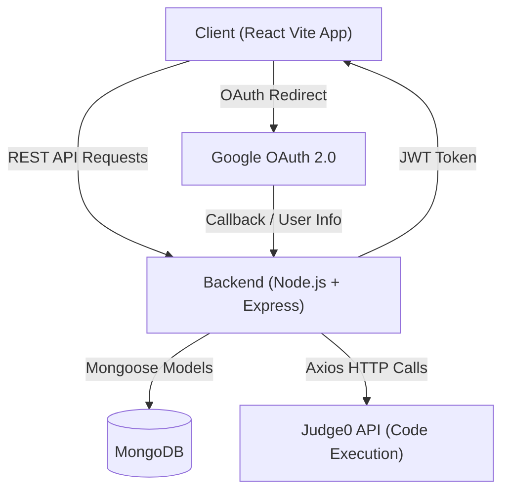
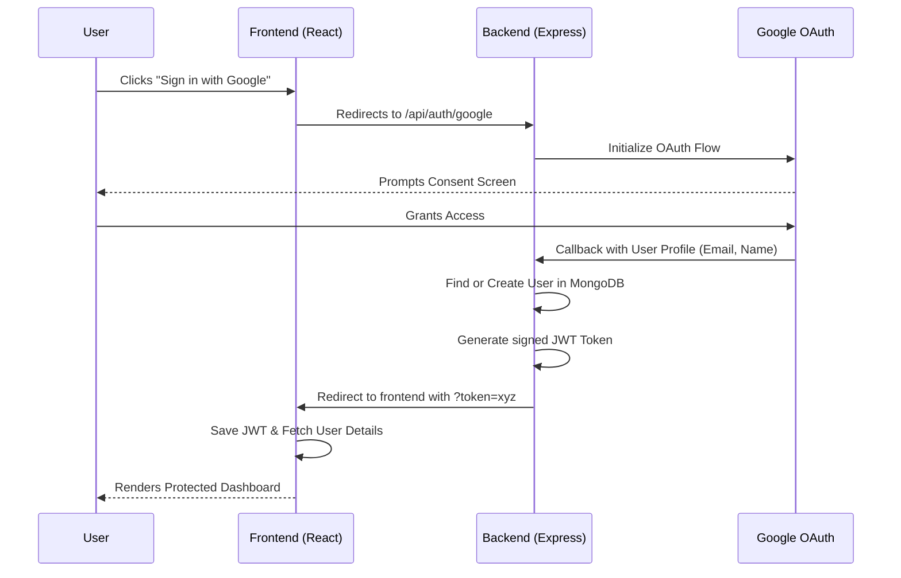
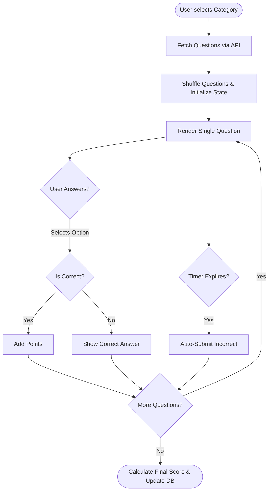
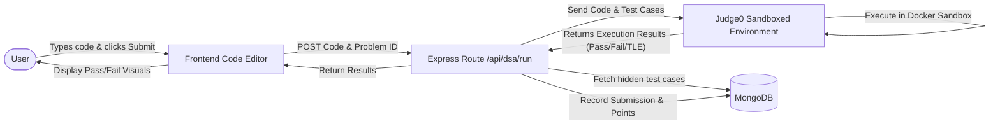
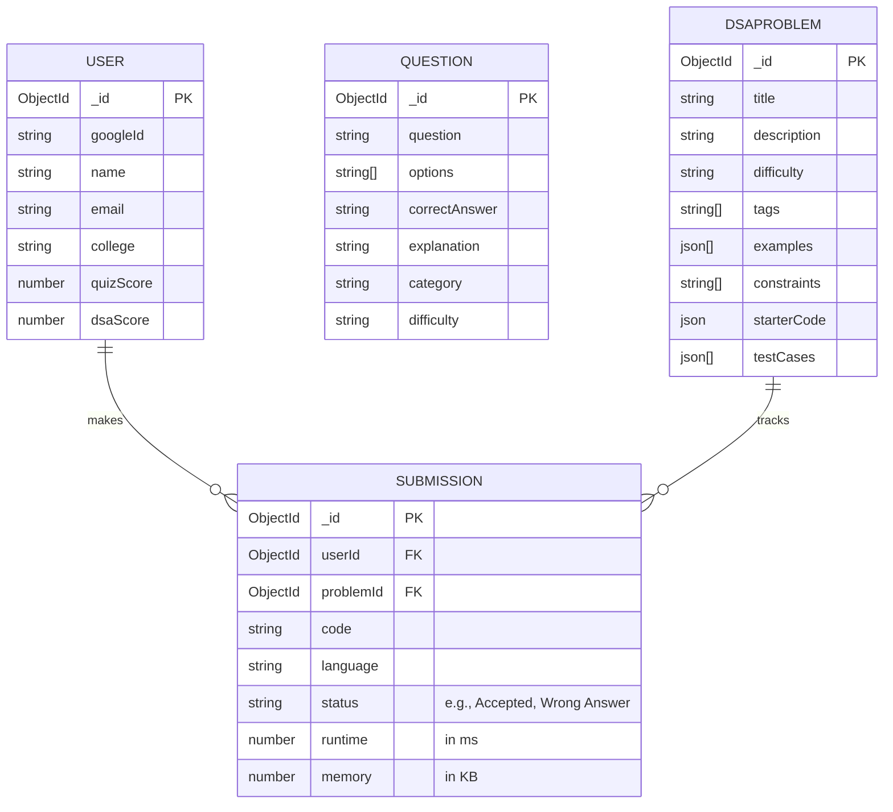

# Tech Arena — Complete Project Information

**Author:** Aditya Mohod  
**Repository:** [github.com/mohodaditya/Tech_Arena](https://github.com/mohodaditya/Tech_Arena)  
**Homepage:** [mohodaditya.github.io/Tech_Arena](https://mohodaditya.github.io/Tech_Arena/)  
**Status:** Alpha / MVP Complete  

---

## 1. Executive Summary

**Tech Arena** is a comprehensive developer skill-building platform designed to help students and developers sharpen their technical skills. The platform is built around three core pillars:

1. **Quizzes** — Timed MCQ quizzes across 10 technical categories.
2. **DSA Problem Solving** — A LeetCode/HackerRank-style coding arena with a built-in code editor and real code execution via Judge0 API.
3. **Gamification & Leaderboard** — A points-based scoring system with a competitive leaderboard.

The application features a premium, responsive UI with light/dark mode, smooth animations, and a professional VS Code-inspired code editor.

---

## 2. System Architecture

The project follows a standard client-server architecture. The frontend is a React application built with Vite, communicating with a Node.js/Express backend, which interacts with a MongoDB database and external APIs like Judge0 for code execution and Google for OAuth authentication.



---

## 3. Tech Stack

### Frontend

| Technology | Purpose |
|---|---|
| **React 18** | Core UI library for building component-driven interfaces. |
| **Vite** | Extremely fast build tool and development server. |
| **React Router DOM** | Client-side routing for seamless page navigation. |
| **Tailwind CSS** | Utility-first CSS framework for rapid UI styling. |
| **Framer Motion** | Declarative animations and page transitions. |
| **Lucide React** | Consistent, clean icon library throughout the app. |
| **Supabase JS** | Authentication client library integration layer. |
| **Canvas Confetti** | Celebration visual effects upon achievements. |
| **gh-pages** | Deployment utility for GitHub Pages. |

### Backend

| Technology | Purpose |
|---|---|
| **Node.js & Express** | Runtime environment and minimal web framework for the API server. |
| **Mongoose** | MongoDB Object Data Modeling (ODM) library for database schemas. |
| **Passport.js (Google OAuth20)** | Authentication middleware for secure Google Sign-in. |
| **JSON Web Token (JWT)** | Stateless token-based authentication mechanism. |
| **Axios** | Handling HTTP client requests (specifically calling the Judge0 API). |
| **CORS / dotenv** | Cross-Origin configuration and environment variable management. |

### External Services

| Service | Purpose |
|---|---|
| **MongoDB Atlas** | Primary cloud database (User profiles, Questions, Scores, Submissions). |
| **Judge0 API** | Remote, sandboxed code execution engine for DSA problems. |
| **Google Cloud Console** | Provides credentials for Google OAuth authentication. |

---

## 4. Project Structure

The repository is organized seamlessly into frontend and backend directories.

```text
Tech_Arena/
├── package.json                # Frontend dependencies
├── vite.config.js              # Vite bundler config
├── tailwind.config.js          # Tailwind styling definitions
│
├── src/                        # FRONTEND CODEBASE
│   ├── main.jsx                # React DOM render entry point
│   ├── App.jsx                 # Routes & Context Providers
│   ├── index.css               # Tailwind directives & global styles
│   │
│   ├── pages/                  # Page-level components
│   │   ├── Home.jsx            # Dashboard
│   │   ├── Login.jsx           # Google Auth Entry
│   │   ├── Quiz.jsx            # Timed MCQ Interface
│   │   ├── DSAProblemSolver.jsx# Split-pane Problem UI
│   │   ├── Leaderboard.jsx     # Global Rankings
│   │   └── ...                 # Other pages (About, Profile, Learn, NotFound)
│   │
│   ├── components/             # Reusable UI parts
│   │   ├── Navbar.jsx          # Top Navigation
│   │   ├── BottomDock.jsx      # Mobile Floating Nav
│   │   └── CodeEditor.jsx      # Embedded VS Code-like editor
│   │
│   ├── context/                # Global State Management
│   │   ├── UserContext.jsx     # Auth state, JWT persistence, scores
│   │   └── ThemeContext.jsx    # Light/Dark mode toggles
│   │
│   └── data/                   # Fallback/seed frontend data
│
├── backend/                    # BACKEND CODEBASE
│   ├── index.js                # Express Server startup
│   ├── package.json            # Backend Node.js dependencies
│   ├── .env                    # Secrets (DB URI, JWT, API Keys)
│   │
│   ├── config/                 # Setup modules
│   │   ├── db.js               # MongoDB connection logic
│   │   └── passport.js         # Google Strategy logic
│   │
│   ├── models/                 # Mongoose Schemas (User, Question, DSAProblem, Submission)
│   ├── routes/                 # Express API Endpoint Handlers (Auth, Quiz, DSA)
│   ├── data/                   # JSON Question Banks for seeding
│   └── seeder.js / dsaSeeder.js# Utility scripts to populate the database
```

---

## 5. Core Application Logic & Flows

### 5.1 Authentication Flow

Authentication follows a secure OAuth 2.0 flow using Passport.js. The backend handles the handshake and redirects the user back with a secure JWT token, which is persisted in `localStorage`.



### 5.2 Quiz System Flow

The quiz system fetches questions from the database, presents them sequentially with a timer, and calculates final scores.



### 5.3 DSA / Code Execution Flow

The DSA Arena utilizes the Judge0 API for secure, remote code execution. Test cases are validated server-side.



---

## 6. Database Schema (Entities & Relationships)

The database models are designed to efficiently track users, questions, coding challenges, and attempt histories.



---

## 7. Commands & Scripts

### Frontend Commands

| Command | Action |
|---|---|
| `npm run dev` | Spins up the Vite local development server. |
| `npm run build` | Bundles the React app for production. |
| `npm run lint` | Runs ESLint to verify code quality. |
| `npm run deploy` | Automated deployment of `/dist` to GitHub Pages. |

### Backend Commands

| Command | Action |
|---|---|
| `npm install` | Installs dependencies (Express, Mongoose, Passport, etc). |
| `npm run dev` | Starts server with Nodemon (auto-restarts on save). |
| `node seeder.js` | Parses JSON files in `/data` and pushes MCQ questions to DB. |
| `node dsaSeeder.js` | Pushes DSA coding problems into the database. |

---

## 8. Development Setup Guide

1. **Clone the repository:**
   ```bash
   git clone https://github.com/mohodaditya/Tech_Arena.git
   cd Tech_Arena
   ```
2. **Frontend Setup:**
   ```bash
   npm install
   npm run dev
   ```
3. **Backend Setup (Open new terminal):**
   ```bash
   cd backend
   npm install
   ```
4. **Environment Variables (`backend/.env`):**
   ```env
   # Example
   MONGO_URI=mongodb+srv://<user>:<password>@cluster.mongodb.net/techarena?retryWrites=true&w=majority
   JWT_SECRET=super_secret_jwt_key
   GOOGLE_CLIENT_ID=your_google_client_id
   GOOGLE_CLIENT_SECRET=your_google_client_secret
   JUDGE0_API_KEY=your_rapidapi_key
   JUDGE0_API_HOST=judge0-ce.p.rapidapi.com
   ```
5. **Database Seeding & Start:**
   ```bash
   node seeder.js
   node dsaSeeder.js
   npm run dev
   ```
